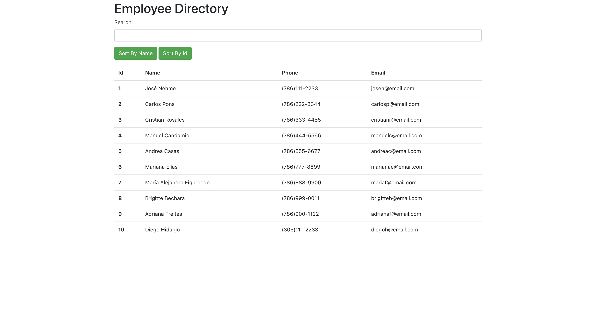
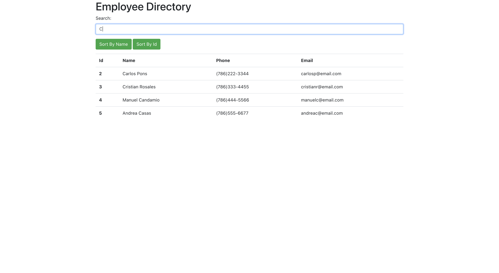
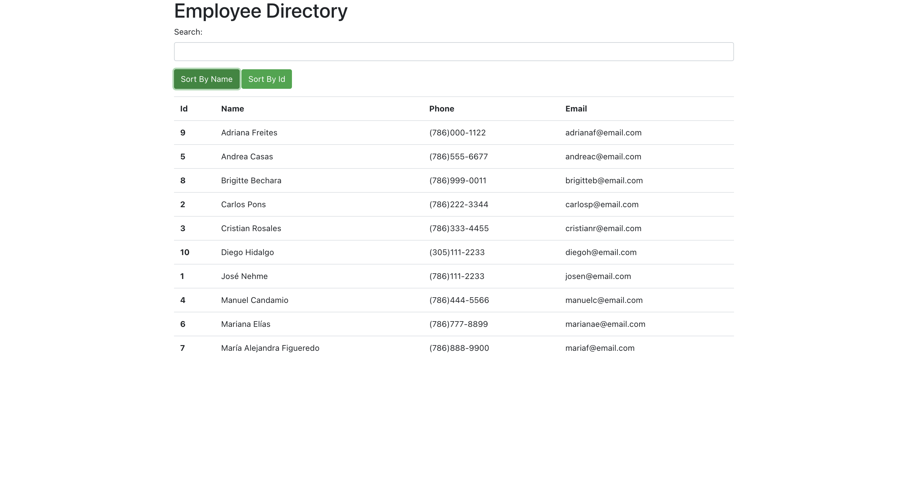

# Employee Directory

  ## Table of Contents
  1. [Description](#description "Description")
  2. [Installation](#installation "Installation")
  3. [Usage](#usage "Usage")
  4. [License](#license "License")
  5. [Contribution](#contribution "Contributing")
  6. [Tests](#tests "Tests")
  7. [Questions](#questions "Questions")

  ## Description
  [](https://opensource.org/licenses/Apache-2.0)

  A dynamic table made with React.js which shows basic enployee information. Employee entries can be filtered by first or last name, and can also be sorted by first name or Id.

  

  

  

  ## Installation
  This project does not need to be installed. It's deployed on GitHub Pages. To run it locally use ```npm start``` inside the project's folder. Employee information is stored in a file called employees.json.

  ## Usage
  This app is used to access basic information of employees. The table is dynamic, wich allows for a better user experience.

  ## License
  For more information on the license for this project, please click on the following link:
  [License](https://opensource.org/licenses/Apache-2.0)

  ## Contribution
  This project was a homework for the UM Coding Bootcamp. The entirety of the project was made by Luis Rujana, using React.js.

  ## Tests
  NA

  ## Questions
  If you have any questions regarding this application, please contact me at:  
  [GitHub Page](https://github.com/lmrujana)  
  Email: lmrujanass@gmail.com
